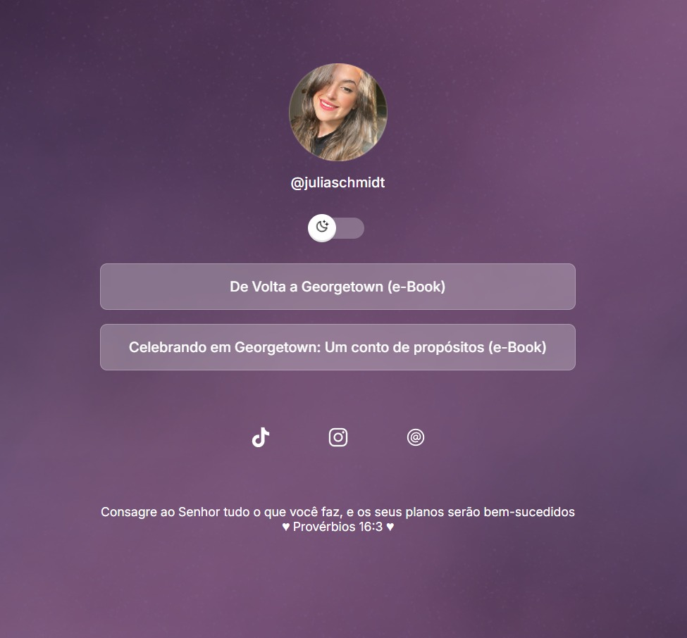

<h1 align="center"> Julia Schmidt -- DevLinks </h1>

Uma página de perfil responsiva com alternador de temas (claro/escuro) para centralizar todos os seus links importantes em um só lugar.

 

  

## 📋 Sobre

O DevLinks é uma landing page pessoal que permite aos usuários ter um local centralizado para compartilhar todos os seus links principais - redes sociais, portfólio, projetos e contatos.

💡 Projeto desenvolvido aplicando conhecimentos adquiridos na Rocketseat

## 💻 Projeto

Aplicando conhecimentos adquiridos na Rocketseat

## ✨ Funcionalidades

* 🌙 Alternador de Tema: Switch entre modo claro e escuro
* 📱 Design Responsivo: Funciona perfeitamente em desktop e mobile
* 🎨 Interface Moderna: Design clean com efeitos glassmorphism
* ⚡ Transições Suaves: Animações fluidas para melhor UX
* 🔗 Links Organizados: Seção dedicada para redes sociais e projetos

## 🚀 Tecnologias

Este projeto foi desenvolvido com as seguintes tecnologias:
* HTML5: Estrutura semântica
* CSS3: Estilização avançada com:
    * CSS Variables (Custom Properties)
    * Flexbox para layouts responsivos
    * CSS Animations e Transitions
    * Backdrop-filter para efeitos de vidro
    * Media Queries para responsividade
* JavaScript: Funcionalidade do switch de tema

## 🎨 Layout

O projeto possui duas versões visuais:
    🌙 Modo Escuro (Padrão)
        * Fundo escuro com elementos brancos/transparentes
        * Ícone da lua no switch
        * Cores suaves para melhor experiência noturna
    

    ☀️ Modo Claro
        * Fundo claro com elementos escuros/transparentes
        * Ícone do sol no switch
        * Cores contrastantes para boa legibilidade

---

Feito com ♥ por Samile Freitas
